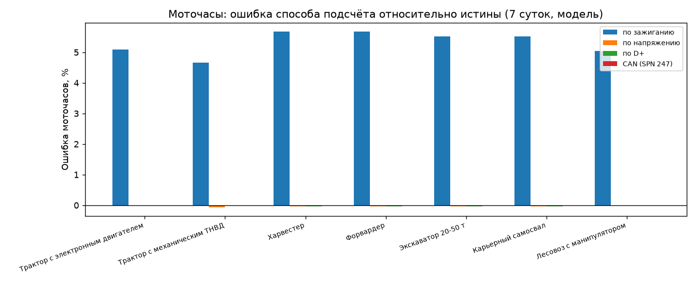
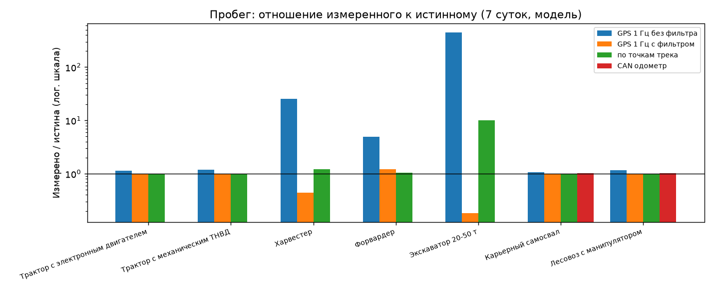
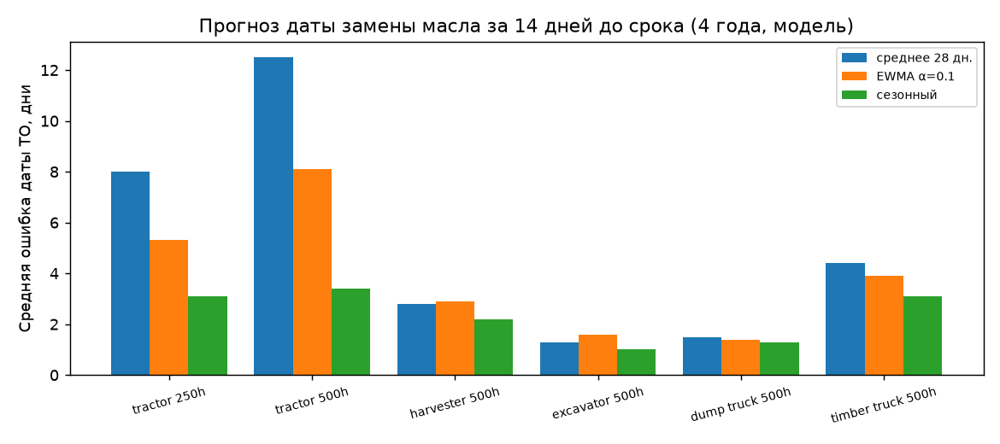

# Результаты сценарного моделирования (генерируется `scripts/run_scenarios.py`)

Все входные параметры — допущения модели (см. `docs/simulation-report.md`). Таблицы показывают последствия проектных решений, а не полевые измерения.

## Моточасы: ошибка способа подсчёта за 7 суток

| Машина | Истинно, ч | Зажигание, % | Напряжение, % | D+, % | Ошибка на интервал 500 ч (зажиг./напр./D+) | CAN: записей со значением, % | CAN: макс. |ошибка|, ч |
|---|---|---|---|---|---|---|---|
| Трактор с электронным двигателем (J1939) | 85.14 | 5.09 | -0.02 | -0.02 | 25.5 / -0.1 / -0.1 ч | 92.0 | 0.051 |
| Трактор с механическим ТНВД (без CAN) | 68.45 | 4.66 | -0.06 | -0.02 | 23.3 / -0.3 / -0.1 ч | 0.0 | — |
| Харвестер | 107.54 | 5.67 | -0.03 | -0.03 | 28.3 / -0.1 / -0.1 ч | 70.5 | 0.066 |
| Форвардер | 107.54 | 5.67 | -0.03 | -0.03 | 28.3 / -0.1 / -0.1 ч | 89.0 | 0.051 |
| Экскаватор 20-50 т | 149.3 | 5.52 | -0.03 | -0.03 | 27.6 / -0.1 / -0.1 ч | 92.2 | 0.051 |
| Карьерный самосвал | 149.3 | 5.52 | -0.03 | -0.03 | 27.6 / -0.1 / -0.1 ч | 98.8 | 0.051 |
| Лесовоз с манипулятором | 79.49 | 5.04 | -0.02 | -0.02 | 25.2 / -0.1 / -0.1 ч | 89.7 | 0.051 |

## Пробег за 7 суток, км

| Машина | Истинный | GPS 1 Гц без фильтра | GPS 1 Гц с фильтром | По точкам трека | CAN |
|---|---|---|---|---|---|
| Трактор с электронным двигателем (J1939) | 833.39 | 941.23 | 837.49 | 832.99 | — |
| Трактор с механическим ТНВД (без CAN) | 660.34 | 789.06 | 663.71 | 661.07 | — |
| Харвестер | 31.49 | 794.99 | 13.9 | 38.36 | — |
| Форвардер | 172.69 | 851.05 | 210.44 | 181.46 | — |
| Экскаватор 20-50 т | 0.98 | 434.39 | 0.18 | 9.9 | — |
| Карьерный самосвал | 2632.41 | 2777.85 | 2620.0 | 2626.12 | 2685.06 |
| Лесовоз с манипулятором | 2345.77 | 2717.15 | 2321.63 | 2347.57 | 2380.96 |

## Связь, задержка доставки, чёрный ящик

| Машина | Онлайн, % | Точек/сут | Доставлено за период, % | Задержка медиана / p95 / макс, ч | Макс. в архиве | Суток до переполнения 170 000 | CAN-запросов/сут |
|---|---|---|---|---|---|---|---|
| Трактор с электронным двигателем (J1939) | 91.5 | 1709 | 100.0 | 0.01 / 0.06 / 0.46 | 61 | 99 | 0 |
| Трактор с механическим ТНВД (без CAN) | 91.5 | 1410 | 100.0 | 0.01 / 0.05 / 0.46 | 60 | 121 | 0 |
| Харвестер | 0.0 | 334 | 0.0 | None / None / None | 2337 | 509 | 1440 |
| Форвардер | 23.0 | 886 | 98.8 | 0.08 / 4.8 / 28.86 | 381 | 192 | 0 |
| Экскаватор 20-50 т | 99.0 | 298 | 100.0 | 0.0 / 0.0 / 0.11 | 2 | 570 | 0 |
| Карьерный самосвал | 99.0 | 1943 | 100.0 | 0.01 / 0.02 / 0.19 | 18 | 88 | 0 |
| Лесовоз с манипулятором | 42.8 | 1428 | 98.3 | 0.01 / 6.79 / 36.18 | 571 | 119 | 0 |

## Трафик на машину (закодированные пакеты + оценка TCP/IP)

| Машина | Galileosky, Б/точку · МБ/мес | Wialon IPS, Б/точку · МБ/мес | EGTS, Б/точку · МБ/мес |
|---|---|---|---|
| Трактор с электронным двигателем (J1939) | 53.4 · 3.13 | 160.5 · 8.44 | 48.5 · 4.35 |
| Трактор с механическим ТНВД (без CAN) | 39.5 · 1.97 | 114.1 · 5.03 | 42.1 · 3.34 |
| Харвестер | 49.9 · 0.54 | 146.6 · 1.48 | 46.6 · 0.8 |
| Форвардер | 53.2 · 1.71 | 157.8 · 4.4 | 48.8 · 2.35 |
| Экскаватор 20-50 т | 53.4 · 0.54 | 157.5 · 1.44 | 48.5 · 0.75 |
| Карьерный самосвал | 59.1 · 3.78 | 186.2 · 10.94 | 55.6 · 5.2 |
| Лесовоз с манипулятором | 57.4 · 2.73 | 179.7 · 7.79 | 54.4 · 3.8 |

## Варианты настроек

```json
{
 "harvester_no_active_request": {
  "records_with_can_hours_pct": 0.0
 },
 "tractor_24v_threshold_set_for_12v": {
  "true_h": 42.19,
  "voltage_method_h": 72.0,
  "error_pct": 70.7
 },
 "harvester_min_speed_1.5": {
  "true_km": 15.98,
  "gps_1hz_filtered_km": 46.16
 },
 "harvester_min_speed_3.0": {
  "true_km": 15.98,
  "gps_1hz_filtered_km": 7.47
 },
 "harvester_min_speed_5.0": {
  "true_km": 15.98,
  "gps_1hz_filtered_km": 0.0
 },
 "excavator_min_speed_1.5": {
  "true_km": 0.39,
  "gps_1hz_filtered_km": 3.21
 },
 "excavator_min_speed_3.0": {
  "true_km": 0.39,
  "gps_1hz_filtered_km": 0.08
 },
 "excavator_min_speed_5.0": {
  "true_km": 0.39,
  "gps_1hz_filtered_km": 0.0
 },
 "forwarder_min_speed_1.5": {
  "true_km": 85.7,
  "gps_1hz_filtered_km": 118.59
 },
 "forwarder_min_speed_3.0": {
  "true_km": 85.7,
  "gps_1hz_filtered_km": 103.93
 },
 "forwarder_min_speed_5.0": {
  "true_km": 85.7,
  "gps_1hz_filtered_km": 86.09
 }
}
```

## Прогноз даты замены масла (ошибка в днях)

| Класс, интервал | Моточасов/год | Замен за 4 года | Упреждение | Среднее 28 дн.: MAE / P90 / доля «позже» | EWMA: MAE / P90 | Сезонный: MAE / P90 |
|---|---|---|---|---|---|---|
| Трактор (юг, полевые работы), 250 ч | 1460.0 | 23 | 30 дн | 66.1 / 299 / 0.83 | 51.7 / 199 | 20.6 / 48 |
| Трактор (юг, полевые работы), 250 ч | 1460.0 | 23 | 14 дн | 8.0 / 32 / 0.61 | 5.3 / 12 | 3.1 / 6 |
| Трактор (юг, полевые работы), 250 ч | 1460.0 | 23 | 7 дн | 3.7 / 4 / 0.57 | 3.3 / 4 | 1.3 / 3 |
| Трактор (юг, полевые работы), 500 ч | 1460.0 | 11 | 30 дн | 66.4 / 299 / 0.73 | 53.8 / 199 | 18.5 / 32 |
| Трактор (юг, полевые работы), 500 ч | 1460.0 | 11 | 14 дн | 12.5 / 34 / 0.55 | 8.1 / 21 | 3.4 / 6 |
| Трактор (юг, полевые работы), 500 ч | 1460.0 | 11 | 7 дн | 6.2 / 17 / 0.55 | 5.0 / 11 | 1.5 / 3 |
| Харвестер/форвардер (2 смены), 500 ч | 4534.0 | 36 | 30 дн | 16.1 / 27 / 0.62 | 14.7 / 11 | 5.3 / 20 |
| Харвестер/форвардер (2 смены), 500 ч | 4534.0 | 36 | 14 дн | 2.8 / 7 / 0.41 | 2.9 / 5 | 2.2 / 3 |
| Харвестер/форвардер (2 смены), 500 ч | 4534.0 | 36 | 7 дн | 1.9 / 3 / 0.47 | 2.5 / 3 | 1.8 / 2 |
| Карьерный экскаватор (2 смены), 500 ч | 6097.0 | 48 | 30 дн | 1.9 / 4 / 0.43 | 2.3 / 5 | 1.7 / 3 |
| Карьерный экскаватор (2 смены), 500 ч | 6097.0 | 48 | 14 дн | 1.3 / 3 / 0.52 | 1.6 / 4 | 1.0 / 2 |
| Карьерный экскаватор (2 смены), 500 ч | 6097.0 | 48 | 7 дн | 0.8 / 2 / 0.37 | 0.8 / 2 | 0.8 / 2 |
| Карьерный самосвал (2 смены), 500 ч | 5924.0 | 47 | 30 дн | 2.8 / 6 / 0.47 | 3.0 / 7 | 2.5 / 5 |
| Карьерный самосвал (2 смены), 500 ч | 5924.0 | 47 | 14 дн | 1.5 / 3 / 0.42 | 1.4 / 3 | 1.3 / 3 |
| Карьерный самосвал (2 смены), 500 ч | 5924.0 | 47 | 7 дн | 0.8 / 2 / 0.35 | 0.9 / 2 | 0.8 / 2 |
| Лесовоз (зимник + лето), 500 ч | 3074.0 | 24 | 30 дн | 7.2 / 20 / 0.7 | 6.5 / 18 | 5.1 / 14 |
| Лесовоз (зимник + лето), 500 ч | 3074.0 | 24 | 14 дн | 4.4 / 8 / 0.43 | 3.9 / 7 | 3.1 / 5 |
| Лесовоз (зимник + лето), 500 ч | 3074.0 | 24 | 7 дн | 3.5 / 5 / 0.48 | 2.8 / 4 | 2.9 / 3 |






